# CIC抽取滤波器


## CIC 滤波器特性

CIC 的系统响应可以表示为：
$$
H(z)=\frac{({1-z^{-R*M}})^N}{({1-z^{-1}})^N}
$$
其中N表示CIC滤波器的阶数；R表示滤波器的速率改变倍数(抽取或者内插)；M表示差分延迟。

CIC滤波器的幅频响应如下式子，f表示离散时间频率
$$
|H(f))| = [\frac{sin(\pi RMf)}{sin(\pi f))}]^{N}
$$
CIC的幅频响应如下图所示，可以知道在f=n*(1/RM)时，存在零点，因此差分延迟M可以调整零点的起始位置


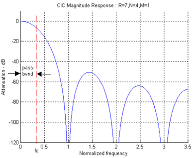


下图显示了差分延迟M对CIC滤波器的影响。从图中可以看到，M除了影响零点的位置，增加M也会对旁瓣衰减产生较大影响，但是通带边沿衰减也较为严重。

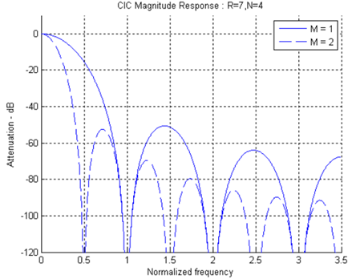

下图显示了CIC滤波器速率变化参数R对频率响应的影响。从图中可以看到，随着R的增大，通带边沿衰减加大，旁瓣由一定程度的衰减，但变化不大。从时域来讲，增加R即增加CIC滤波器矩形窗口RM长度。

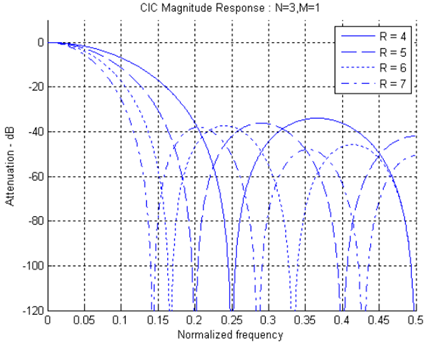

下图显示了改变CIC滤波器阶数N对幅频特性的影响。增加N即增加CIC滤波器级联级数，级联数越大，旁瓣衰减也越大，同时通带边沿衰减也有一定程度增大。

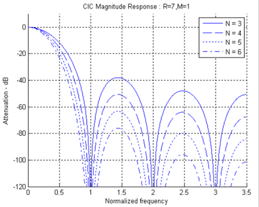

从上面的几个过程当中可以看出增大M、R及N都能增大CIC滤波器的旁瓣衰减，但对于具体项目应用来说，通常将M及R作为“固定值”，仅通过调整N来改变CIC滤波器旁瓣衰减，以满足滤波器要求。

另外，也可以看到随着N的增加，通带边沿衰减也较为严重，导致CIC通带不平坦加大，对信号带来失真。因此，在使用CIC滤波器时，通常要求设计补偿滤波器（CFIR），主要是补偿CIC滤波器通带衰减，使其通带尽量平坦。

对于补偿滤波器，由于CIC滤波器频率响应具有sinc函数形状，通常补偿滤波器具有反sinc函数形状，如式3所示。

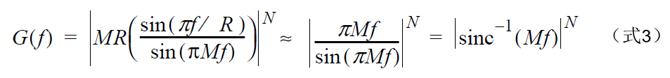

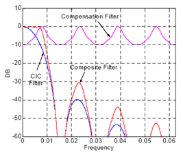

补偿滤波器和CIC滤波器一起使用能够使得通带更平稳。


##  CIC抽取滤波器

CIC抽取滤波器主要由三个部分组成，分别是积分器，抽取器和梳状器。


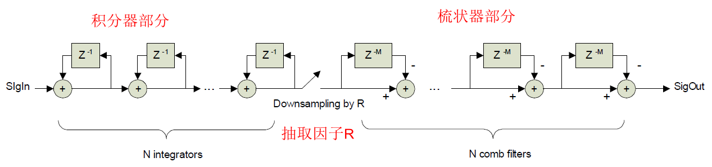

积分器工作在fs采样率，梳状器工作在fs/R速率下，滤波器只有延迟线及加、减法器组成，这有利于硬件实现速率的提高。

CIC输出数据位宽和设计参数N、M和R有关。全精度CIC抽取输出位宽Bmax可以表示为

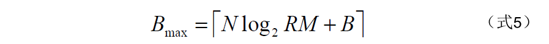

为了获得完全的精度，CIC抽取器实现在内部为每个积分器和微分器级使用Bmax位。这在输出端不会引入量化误差。当以量化噪声为代价使用有限精度输出时，CIC抽取器实现中的硬件资源可以减少。这种权衡资源和量化噪声的能力对于实现最佳实现非常重要。


## CIC内插器

CIC内插器结构与CIC抽取滤波器类似，只不过梳状器和积分器的顺序进行了变化。上采样速率因子R，该速率在梳状器和积分器之间变化，即每个输入采样值间插入R-1个0值。

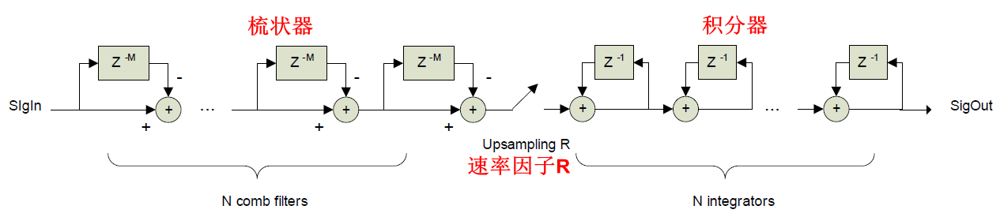

CIC内插器输出数据位宽和设计参数N、M和R有关。全精度CIC抽取输出位宽Bmax可以表示为

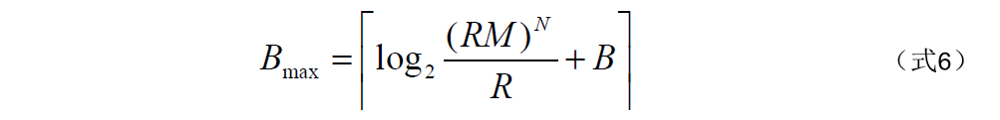


## CIC抽取器实现

CIC抽取滤波器的实现可以参考具体的代码： rtl/cic_dec.v

主要实现了三个部分，分别是累加器，累加器的作用就是


累加器：

根据滤波器的阶数来确定循环次数，每个循环内部做的事情是一样的。将输入数据和之前的累加和进行累加。上一阶的累加和输出，作为下一阶的输入

```verilog
    generate    
        genvar i;
        for ( i=0 ; i<N ; i=i+1 ) begin :LOOP
            reg  [BOUT-1:0]acc;
            wire [BOUT-1:0]sum;
            if ( i == 0 ) begin
                assign sum = acc + {{(BOUT-BIN){din[BIN-1]}},din};
            end else begin
                assign sum = acc + ( LOOP[i-1].sum );
            end
            always@(posedge clk)begin
                if (rst==1'b1)begin
                    acc <= {(BOUT){1'd0}};
                end else if (din_valid == 1'b1) begin
                    acc <= sum;
                end   
            end    
        end
    endgenerate
    wire [BOUT-1:0]acc_out;
    assign acc_out=LOOP[N-1].sum;
```


抽取器：

抽取器比较简单，就是每隔一段时间，使输出的数据有效。

```verilog
    reg [$clog2(R)-1:0]cnt0;
    reg [BOUT-1:0]dec_out;
    assign dval = (cnt0==(R-1));
    always@(posedge clk)begin
        if (rst==1'b1) begin
            cnt0    <=  'd0;
            dec_out <=  'd0;
        end else if(din_valid == 1'b1)begin
            cnt0    <=  dval?'d0        :cnt0 + 1'd1;
            dec_out <=  dval?acc_out   :dec_out;
        end
    end
```

梳状器：

梳状器其实和积分器比较类似，当前的输入需要减去延迟M个采样点的作为本阶的输出。

```verilog
generate
    genvar j;
    for ( j=0 ; j<N ; j=j+1 ) begin :LOOP2
        reg  [BOUT-1:0]comb[0:M-1];
        wire [BOUT-1:0]sub;   
        integer k;
        if ( j == 0 ) begin
            if (M==1) begin
                assign sub = dec_out - comb[0];
                always@(posedge clk )begin
                    if (rst==1'b1)begin
                        comb[0] <= {(BOUT){1'd0}};
                    end else begin
                        comb[0] <= (dval) ? dec_out : comb[0];
                    end
                end  
            end else begin
                assign sub = dec_out - comb[M-1];
                always@(posedge clk )begin
                    if (rst==1'b1)begin
                        for (k = 0; k<M; k=k+1) begin
                            comb[k] <= {(BOUT){1'd0}};
                        end
                    end else if (dval) begin
                        comb[0] <= dec_out;
                        for (k = 1; k<M; k=k+1) begin
                            comb[k] <= comb[k-1];
                        end
                    end 
                end  
            end
        end else begin
            if (M==1) begin
                assign sub = LOOP2[j-1].sub - comb[0];
                always@(posedge clk )begin
                    if (rst==1'b1)begin
                        comb[0] <= {(BOUT){1'd0}};
                    end else begin
                        comb[0] <= (dval) ? LOOP2[j-1].sub : comb[0];
                    end
                end  
            end else begin
                assign sub = LOOP2[j-1].sub - comb[M-1];
                always@(posedge clk )begin
                    if (rst==1'b1)begin
                        for (k = 0; k<M; k=k+1) begin
                            comb[k] <= {(BOUT){1'd0}};
                        end
                    end else if(dval)begin
                        comb[0] <=  LOOP2[j-1].sub;
                        for (k = 1; k<M; k=k+1) begin
                            comb[k] <= comb[k-1];
                        end
                    end
                end 
            end

        end
    end
endgenerate
assign dout = LOOP2[N-1].sub;
```

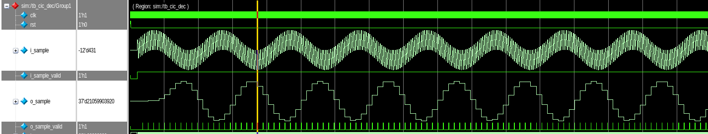


## CIC 匹配滤波器

关于CIC匹配滤波器，可以直接使用matlab当中的匹配滤波器，具体的信息可以参考下面的连接：

[CIC匹配滤波器](https://ww2.mathworks.cn/help/dsp/ref/fdesign.ciccomp.html?requestedDomain=cn)

```matlab
%% cic compensating filter design
%% Two design methods are listed/compared:
%%      fir2.m -- frequency sampling method; Signal Processing Toolbox Required
%%      firceqrip.m -- Equal Rippler Design Method; Filter Design Toolbox Required
%% Output: filter coefficients saved in fdcoeff.txt in the format that can
%%          be readily loaded by Altera FIR Compiler MegaCore

clear all
close all

%%%%%% CIC filter parameters %%%%%%
R = 4;                                      %% Decimation factor
M = 1;                                      %% Differential Delay
N = 8;                                      %% Number of Stages
B = 18;                                     %% Number of bits to represent fixed point filter coefficients
Fs = 91.392e6;                                 %% (High) Sampling frequency in Hz (before decimation)
Fc = 4.85e6;                                   %% Passband edge in Hz
%%%%%%% fir2.m parameters %%%%%%%%%%%%%%%%%%%%%%%%%%%%%%%%
L = 110;                                     %% Order of filter taps; must be an even number
Fo = R*Fc/Fs;                             %% Normalized Cutoff freq; 0<Fo<=0.5/M; xdong: modified 10/30/06: taken out /M.
                                          %% Fo should be less than 1/(4M), if not, bad performance is guranteed                                 
% Fo = 0.5/M;                                 %% use Fo=0.5 if we don't care responses outside passband

%%%%%%% CIC Compensator Design using fir2.m %%%%%%
p = 2e3;                                    %% Granulatiry
s = 0.25/p;                               %% Stepsize
fp = [0:s:Fo];                              %% Passband frequency samples
                                            %% xdong: modified 10/30/06:
                                            %% taken out /M
fs = (Fo+s):s:0.5;                          %% Stopband frequency samples
f = [fp fs]*2;                            %% Noramlized frequency samples; 0<=f<=1; taken out *M 11/29/06
Mp = ones(1,length(fp));                    %% Passband response; Mp(1)=1
Mp(2:end) = abs( M*R*sin(pi*fp(2:end)/R)./sin(pi*M*fp(2:end))).^N; %% Inverse sinc
Mf = [Mp zeros(1,length(fs))];
f(end) = 1;
h = fir2(L,f,Mf);                           %% Filter length L+1
h = h/max(h);                              %% Floating point coefficients
hz = round(h*power(2,B-1)-1);                   %% Quantization of filter coefficients

%%%%%%% fixed point CIC filter response %%%%%%%%
hrec = ones(1,R*M);
tmph = hrec;

for k=1:N-1
    tmph = conv(hrec, tmph);
end;
hcic = tmph;
hcic=hcic/norm(hcic);

%%%%%%% Total Response %%%%%%%%%%%%%%%
hzp = upsample(hz,R);
hp = upsample(h, R);
ht = conv(hcic, hp);                        %% Concatenation of CIC and fir2 FIR at high freqency
hzt = conv(hcic, hzp);                      %% CIC + Fixed point fir2 at high frequency

[Hcic, wt] = freqz(hcic, 1, 4096, Fs);      %% CIC Freq. Response
[Hciccomp, wt] = freqz(hp, 1, 4096, Fs);    %% CIC Comp. response using fir2
[Ht, wt] = freqz(ht, 1, 4096, Fs);          %% Total response for CIC + floating point fir2
[Hzt, wt] = freqz(hzt, 1, 4096, Fs);        %% Total response for CIC + fixed point fir2

Mcic = 20*log10(abs(Hcic)/max(abs(Hcic)));  %% CIC Freq. Response
Mciccomp = 20*log10(abs(Hciccomp)/max(abs(Hciccomp)));  %% CIC Comp. response using fir2
Mt = 20*log10(abs(Ht)/max(abs(Ht)));        %% Total response for CIC + floating point fir2
Mzt = 20*log10(abs(Hzt)/max(abs(Hzt)));     %% Total response for CIC + fixed point fir2

figure;
plot(wt, Mcic, wt, Mciccomp, wt, Mt,wt, Mzt);
legend('CIC','CIC Comp','Total Response (Floating Point)','Total Response (Fixed Point)')
ylim([-100 5]);
title('Frequency Sampling Method');
grid
xlabel('Frequency Hz');
ylabel('Filter Magnitude Response dB');


%%%%%%%%%%% If no access to MATLAB Filter Design Toolbox, please comment
%%%%%%%%%%% out from here %%%%%%%%%%%%%%%%%%%%%%%%%%%%%%%%%%%%%%%%%%%%%%%
%%%%%%% CIC Compensator Design using firceqrip.m %%%%%%%%%%%%%%%%%%%
Ast = 90;                                   %% Stop band attenuation in dB
Ap = 0.01;                                  %% Passband ripple in dB
c = M/2;                                    %% Sinc frequency scaling
Apass = power(10, Ap/20) - 1;               %% passband variation corresponding to Ap
Astop = power(10, -Ast/20);                 %% stop band variation corresponding to Ast
Aslope = 40;                                %% Slope in dB
fc = Fo*2*M;                                %% Normalized cutoff frequency (to Nyquist freq.); 0<=fc<=1;
heq = firceqrip(L, fc, [Apass, Astop], 'passedge', 'slope', Aslope, 'invsinc', [c, N]);
heq = heq/norm(heq);                        %% Floating point coefficients
hc = floor(heq*power(2,B));                 %% Quantization of filter coefficients

hcp = upsample(heq, R);
hct = conv(hcic, hcp);                      %% CIC + Floating Point Equal Ripple FIR at high frequency
[Het, wc] = freqz(hcp, 1, 4096, Fs);        %% Freq. Response of Equal Ripple FIR at high freq.
[Hct, wc] = freqz(hct, 1, 4096, Fs);        %% CIC + floating point Equal Ripple FIR
Me = 20*log10(abs(Het)/max(abs(Het)));      %% Freq. Response of Equal Ripple FIR at high freq.
Mc = 20*log10(abs(Hct)/max(abs(Hct)));      %% CIC + floating point Equal Ripple FIR

figure;
plot(wt, Mcic, wc, Me, wc, Mc);
legend('CIC','CIC Comp','Total Response Floating Point')
% xlim([0 2/R]);
ylim([-100 5]);
grid
title('Equal Ripple Method');
xlabel('Frequency Hz');
ylabel('Filter Magnitude Response dB');
%%%%%%%%%%% end of Comment Out %%%%%%%%%%%%%%%%%%%%%%

filename = ['fdcoeffR',num2str(R),'N',num2str(N),'M',num2str(M),'L',num2str(L),'.txt'];
fid = fopen(filename, 'wt');
fprintf(fid, '%18.0f \n', hz); %% fixed point coeff
% fprintf(fid, '%0.6d\n',h); %% floating point
fclose(fid)
```

