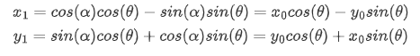
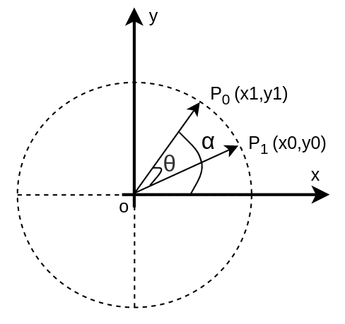
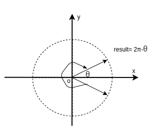

# cordic 算法的实现

## 1. Cordic的旋转模式

### 1.1 逆时针旋转

假设单位圆上有两个点P0,P1,假设P0与x轴的夹角为 α，P1与x轴的夹角为θ+α。


那么


可以得到如下关系：



可以得出如下的坐标矩阵形式


上面的形式可以看做是坐标由一点经过**逆时针旋转**到另外一点的结果

### 1.2 顺时针旋转

在前面我们得到了逆时针旋转的结果，如果是顺时针我们也可以按照上面的思路进行处理。



得到的结果如下：


可以看到在第一象限当中，如果想要进行坐标的旋转，结合上面的两种公式，就可以实现一点到另外一点的旋转了。

### 1.3 一般旋转过程

接下来就来到了cordic算法比较有趣的部分了，如果我们在旋转的时候，以某些特定的角度来进行旋转，那么每次旋转，需要确定的tan(θ)的值和cos(θ)的值就是固定的。

如果我们再令这个情况再特殊一点，每次旋转的角度的大小是arctan(1/2^n) 也就是每次旋转的角度，对应到tan(θ)上就是1, 1/2, 1/4....这些特定的角度，这样每次确定的cos(θ)的值也就是固定的，每次旋转的时候，需要确定旋转的方向，这样我们能够实现从一个点到另外一个点旋转了。

假设经过一系列的旋转之后，最终得到的点的坐标的表达式为：


我们可以用下面的代码来确定每次旋转时的角度以及对应的值：


```matlab
%% atan via cordic. Input is x,y, output is cordic_change
function [x_n,y_n]=cordic_atan2(x,y,theta_pi)
    x_n=x+y*tan(theta_pi);
    y_n=-1*x*tan(theta_pi)+y;
```


```matlab
clc;
clear all;
close all;

N = 20;
angle = zeros(1, N);
fix_angle = zeros(1, N);
multi_factor =1;
angel_sum = 0;
xn = 1;
fid = fopen('tmp.txt', 'wt');
fid_angle = fopen('fix_angle.txt', 'wt');
tmp = 1;
for i=1:N
    angle(i) = atan(1/(bitshift(1,i-1)));
    fix_angle(i) = round((angle(i)/(2*pi))*2^20);
    xn = xn + (1/(bitshift(1,i-1)));
    multi_factor = cos(angle(i)) * tmp;
    tmp = multi_factor;
    angel_sum = angel_sum + angle(i);
    fprintf(fid, 'tan(theta)is %f, angle(%i) is %f Radian, cos_theta is %f, angle_sum is %f, factor is %f\n',1/(bitshift(1,i-1)), i, angle(i), cos(angle(i)), angel_sum, multi_factor);
    fprintf(fid_angle, '%x\n', fix_angle(i));
end
fprintf(fid,'multi_factor is %f, angel_sum is %f degrees, xn=%f\n',multi_factor, (angel_sum/(2*pi))*360, xn);
fclose(fid);
fclose(fid_angle);
```


```c#
tan(theta)is 1.000000, angle(1) is 0.785398 Radian, cos_theta is 0.707107, angle_sum is 0.785398, factor is 0.707107
tan(theta)is 0.500000, angle(2) is 0.463648 Radian, cos_theta is 0.894427, angle_sum is 1.249046, factor is 0.632456
tan(theta)is 0.250000, angle(3) is 0.244979 Radian, cos_theta is 0.970143, angle_sum is 1.494024, factor is 0.613572
tan(theta)is 0.125000, angle(4) is 0.124355 Radian, cos_theta is 0.992278, angle_sum is 1.618379, factor is 0.608834
tan(theta)is 0.062500, angle(5) is 0.062419 Radian, cos_theta is 0.998053, angle_sum is 1.680798, factor is 0.607648
tan(theta)is 0.031250, angle(6) is 0.031240 Radian, cos_theta is 0.999512, angle_sum is 1.712038, factor is 0.607352
tan(theta)is 0.015625, angle(7) is 0.015624 Radian, cos_theta is 0.999878, angle_sum is 1.727662, factor is 0.607278
tan(theta)is 0.007812, angle(8) is 0.007812 Radian, cos_theta is 0.999969, angle_sum is 1.735474, factor is 0.607259
tan(theta)is 0.003906, angle(9) is 0.003906 Radian, cos_theta is 0.999992, angle_sum is 1.739380, factor is 0.607254
tan(theta)is 0.001953, angle(10) is 0.001953 Radian, cos_theta is 0.999998, angle_sum is 1.741333, factor is 0.607253
tan(theta)is 0.000977, angle(11) is 0.000977 Radian, cos_theta is 1.000000, angle_sum is 1.742310, factor is 0.607253
tan(theta)is 0.000488, angle(12) is 0.000488 Radian, cos_theta is 1.000000, angle_sum is 1.742798, factor is 0.607253
tan(theta)is 0.000244, angle(13) is 0.000244 Radian, cos_theta is 1.000000, angle_sum is 1.743042, factor is 0.607253
tan(theta)is 0.000122, angle(14) is 0.000122 Radian, cos_theta is 1.000000, angle_sum is 1.743165, factor is 0.607253
tan(theta)is 0.000061, angle(15) is 0.000061 Radian, cos_theta is 1.000000, angle_sum is 1.743226, factor is 0.607253
tan(theta)is 0.000031, angle(16) is 0.000031 Radian, cos_theta is 1.000000, angle_sum is 1.743256, factor is 0.607253
tan(theta)is 0.000015, angle(17) is 0.000015 Radian, cos_theta is 1.000000, angle_sum is 1.743271, factor is 0.607253
tan(theta)is 0.000008, angle(18) is 0.000008 Radian, cos_theta is 1.000000, angle_sum is 1.743279, factor is 0.607253
tan(theta)is 0.000004, angle(19) is 0.000004 Radian, cos_theta is 1.000000, angle_sum is 1.743283, factor is 0.607253
tan(theta)is 0.000002, angle(20) is 0.000002 Radian, cos_theta is 1.000000, angle_sum is 1.743285, factor is 0.607253
multi_factor is 0.607253, angel_sum is 99.882857 degrees, xn=2.999998
```

可以看到经过一些列的旋转之后，最终的模长校正因子的大小为0.607253, 最大能够旋转的角度是99.89°，不加模长校正因子能够得到的最大的长度大约为3.

下面的一个matlab代码给出了一个点旋转到横轴上的过程,在这个过程当中，没有添加模长校正因子，具体代码可以看matlab文件夹下的代码

```matlab
%% check atan process!
clc
x=10;
y=20;
N=6;

MAX_times=12;
x_n=zeros(MAX_times,1);
y_n=zeros(MAX_times,1);
a_n=zeros(MAX_times,1);
%% orignal data
fprintf('orignal is \t %f,%f\n',x,y);
%% first step
i=1;
angle(i)=atan(1/bitshift(2,i-2));
%[x_n(i),y_n(i)]=cordic_atan2(x_n(i-1),y_n(i-1),angle(i));
[x_n(i),y_n(i)]=cordic_atan2(x,y,angle(i));
fprintf('shift %d result is \t %f,%f,%f\n',i,x_n(i),y_n(i),angle(i));
%% loop step
for i=2:N
    if(y_n(i-1)>0)
        angle(i)=atan(1/bitshift(2,i-2));
    else
        angle(i)=-atan(1/bitshift(2,i-2));
    end
    [x_n(i),y_n(i)]=cordic_atan2(x_n(i-1),y_n(i-1),angle(i));
    fprintf('shift %d result is \t %f,%f,%f\n',i,x_n(i),y_n(i),angle(i));
end
%% get final angle
angle_rotate=sum(angle);
err_angle=angle_rotate-atan(y/x);
fprintf('total angle is %f,error angle %f\n',angle_rotate,err_angle);
 
%% plot the trace
plot_axis(x,y);
for i=1:N
    cordic_plot(x_n(i),y_n(i),i);
end
plot([x,x_n(1:N)'],[y,y_n(1:N)'],'g');
export_fig axis.png -m2 % 5 times resolution
```


只用六次旋转求出来的(10,20)这个点的弧度是 total angle is 1.128490,与标准的结果的误差是error angle 0.021341。

如果我们使用16次旋转，那么这个得到的结果是 total angle is 1.107189,与标准的结果的误差是error angle 0.000040。


## 2. FPGA实现Cordic思路

在FPGA当中，cordic既可以用来求cos与sin的值，又可以用来求角度。我们可以根据需要来确定cordic的工作方式。不管cordic是何种目的，其基本的原理都是一样的，都是根据前面的坐标旋转为基础的。

根据前面我们介绍的cordic的matlab的代码可以知道，在20次旋转条件下，cordic能够旋转得到的最大角度在(-99.89°，99.89°)。

根据三角函数的知识，我们不难想到将其他象限的点都转换到第一象限来进行处理。




### 2.1 Cordic NCO模式

所谓NCO模式，就是根据一个已知的角度来求取这个角度对应的cos或者sin的值。

假设我们已知的角度的大小为30°，这个角在第一象限，为了求取这个角的cos与sin,我们可以从点(1,0)作为起点，经过多次的旋转(顺时针or逆时针)，最终逼近这个点，当所有的旋转结束之后，此时得到的x,y的坐标就是cos(30°)与sin(30°)。

如果我们已知的角度的大小是150°，这个角在第二象限如果我们直接从(1,0)这个点，是无法旋转到这个角度的。因此我们可以先求出关于Y轴对称的这个点的cos和sin，然后将对应的cos值取负就可以得到最终的值。

如果已知的角度的大小是210°，在第三象限，我们可以求这个点关于原点对称的点的cos和sin值，然后将x,y分别取反就可以得到最终的值。

如果已知角度的大小是330°，在第四象限，我们可以求这个点关于X轴对称的点的cosh和sin，然后将y 取反就可以得到最终的值。

#### 2.1.1 预处理

在NCO模式下，需要对角度进行预处理，我们需要得到这个角度的象限信息，并且将这个角度转换到第一象限。

```verilog
if (CORDIC_MODE == "NCO") begin
            always @(posedge clk ) begin
                if (rst==1'b1) begin
                    po_info <= 'd0;
                    po_x <= 'd0;
                    po_y <= 'd0;
                    po_z <= 'd0;
                end else if (pi_dv == 1'b1) begin
                    po_x <= pi_x;
                    po_y <= 'd0;
                    po_dv <= 1'b1;
                    case (pi_z[AW-1:AW-2])
                        // if the angle is 0~π/2, first quadrant
                        2'b00: begin
                            po_info[AW+2-1: AW+2-2] <= 2'b00;
                            po_info[AW-1:0] <= pi_z;
                        end
                        // if the angle is π/2~π, second quarant
                        2'b01: begin
                            po_info[AW+2-1: AW+2-2] <= 2'b10;
                            po_info[AW-1:0] <= ONE_PI - pi_z;
                        end
                        // if the angle is π~3π/2, third quarant
                        2'b10: begin
                            po_info[AW+2-1: AW+2-2] <= 2'b11;
                            po_info[AW-1:0] <= pi_z - ONE_PI;
                        end
                        // if the angle is 3π/2~2π, fourth quarant
                        2'b11: begin
                            po_info[AW+2-1: AW+2-2] <= 2'b01;
                            po_info[AW-1:0] <= TWO_PI-1 - pi_z;
                        end
                    endcase
                end else begin
                    po_dv <= 1'b0;
                end
            end
        end
```

#### 2.1.2 迭代处理单元

在迭代处理单元当中，我们的目的就是将一个(1,0)的向量旋转到需要的角度上，因此在迭代单元当中，我们需要注意旋转的方向的判断，x,y的变化量等等。

在迭代单元的第一级，让其逆时针旋转。

在之后的迭代单元当中，需要判断当前得到的角度和目标角度的大小，如果当前的角度大于目标角度，则需要顺时针旋转，反之则逆时针旋转。

在这里要特别注意一下，如果旋转的角度旋转到第四象限的时候，需要逆时针旋转，这种特殊的情况容易出现在比较小的角度的时候，比如，我们的目标角度是1°，由于在NCO模式下，第一次旋转了45°，因此在之后的旋转当中，需要顺时针旋转，又由前面的知识可以知道，最大的旋转角度大约为98.89°，因此一直顺时针旋转的话，是有可能会旋转到第4象限的，因此，当旋转到第四象限的时候，需要逆时针旋转。

```verilog
if (CORDIC_MODE == "NCO") begin
            // in nco module the first stage need anticlockwise rotation
            if (STAGE_N == 0) begin
                always @(posedge clk) begin
                    if (rst==1'b1) begin
                        po_x <= 'd0;
                        po_y <= 'd0;
                        po_z <= 'd0;
                        po_dv<= 1'b0;
                        po_info <= 'd0;
                    end else if(pi_dv == 1'b1)begin
                        po_x <= pi_x - pi_y;
                        po_y <= pi_y + pi_x;
                        po_z <= pi_z + theta_lut[0];
                        po_info <= pi_info;
                        po_dv<= 1'b1;
                    end else begin
                        po_dv<= 1'b0;
                    end
                end
            end else begin
                always @(posedge clk) begin
                    if (rst==1'b1) begin
                        po_x <= 'd0;
                        po_y <= 'd0;
                        po_z <= 'd0;
                        po_dv<= 1'b0;
                        po_info <= 'd0;
                    end else if(pi_dv == 1'b1)begin
                        po_dv<= 1'b1;
                        po_info <= pi_info;
                        // if current angle is in forth quarant, anticlockwise rotation
                        if (pi_z[AW-1]) begin
                            po_x <= pi_x - {{STAGE_N{pi_y[DW-1]}}, pi_y[DW-1 : STAGE_N]};
                            po_y <= pi_y + {{STAGE_N{pi_x[DW-1]}}, pi_x[DW-1 : STAGE_N]};
                            po_z <= pi_z + theta_lut[STAGE_N];
                        end else begin
                            // if current angle is greater than the aim angle, clockwise
                            if (pi_z > pi_info[AW-1:0]) begin
                                po_x <= pi_x + {{STAGE_N{pi_y[DW-1]}}, pi_y[DW-1 : STAGE_N]};
                                po_y <= pi_y - {{STAGE_N{pi_x[DW-1]}}, pi_x[DW-1 : STAGE_N]};
                                po_z <= pi_z - theta_lut[STAGE_N];
                            // else current angle is smaller than the aim angle, anticlockwise
                            end else begin
                                po_x <= pi_x - {{STAGE_N{pi_y[DW-1]}}, pi_y[DW-1 : STAGE_N]};
                                po_y <= pi_y + {{STAGE_N{pi_x[DW-1]}}, pi_x[DW-1 : STAGE_N]};
                                po_z <= pi_z + theta_lut[STAGE_N];
                            end
                        end
                    end else begin
                        po_dv<= 1'b0;			
                    end
                end              
            end
            
        end
```

#### 2.1.3 后处理模块

在后处理模块当中，主要需要实现的任务有两个，一个是对模长进行校正，在前面我们知道，模长校正因子的值为大约为0.607253，因此我们需要对前面迭代单元求出来的结果乘上这个模长校正因子。

如果不做乘法，可以近似代替

 0.60725 ≌ (1/2 + 1/8 - 1/64 - 1/512) - ((1/2 + 1/8 - 1/64 - 1/512)/4096) 

另外一个任务就是根据保存的象限信息，来复原坐标值了。

```verilog
case (info_int5[AW+2-1 -:2])
    // x>0, y>0, first quarant
    2'b00 : begin
        po_x <= x_diff_gain_r1;
        po_y <= y_diff_gain_r1;
    end
    // x>0, y<0, fourth quarant
    2'b01 : begin
        po_x <= x_diff_gain_r1;
        po_y <= ~y_diff_gain_r1 + 1'b1;
    end
    // x<0,y>0, second quarant
    2'b10 : begin
        po_x <= ~x_diff_gain_r1 + 1'b1;
        po_y <= y_diff_gain_r1 ;
    end
    // x<0,y<0, third quarant
    2'b11 : begin
        po_x <= ~x_diff_gain_r1 + 1'b1;
        po_y <= ~y_diff_gain_r1 + 1'b1;
    end
endcase
```

最终的仿真结果如下图所示： 可以看到改变相位增量控制字，能够改变输出信号的频率。


### 2.2 Cordic Angle模式

所谓ANGEL模式，就是我们已经知道了一个点的坐标，需要求这个向量的角度和模长。

同前面的NCO模式一样，如果点的坐标不再第一象限，我们需要转换到第一象限，然后以这个点为起点，向X轴正半轴的方向进行旋转(顺时针或者逆时针)，这样，当旋转一定的次数之后，此时的向量已经十分逼近X轴正半轴，此时求得的点的横坐标就近似等于该向量的模长，此时一共旋转得到的角度的绝对值，就是这个第一象限当中的向量的角度。


对于其他象限的点，转换到第一象限求出来的结果，最终再根据对应的象限信息复原即可。

### 2.2.1 预处理模块

保存象限信息，并将坐标转换到第一象限。

```verilog
else if(CORDIC_MODE == "ANGLE")begin
    always @(posedge clk ) begin
        if (rst==1'b1) begin
            po_info <= 'd0;
            po_x <= 'd0;
            po_y <= 'd0;
            po_z <= 'd0;
        end else if (pi_dv == 1'b1) begin
            po_dv <= 1'b1;
            case ({pi_x[IDW - 1],pi_y[IDW - 1]})
                // first quarant
                2'b00 : begin
                    po_info[AW+2-1: AW+2-2] <= 2'b00;
                    po_x <= {{(ODW-IDW){1'b0}}, pi_x};
                    po_y <= {{(ODW-IDW){1'b0}}, pi_y};
                end
                // fourth quarant
                2'b01 : begin
                    po_info[AW+2-1: AW+2-2] <= 2'b01;
                    po_x <= {{(ODW-IDW){1'b0}}, pi_x};
                    po_y <= {{(ODW-IDW){1'b0}}, (~pi_y+1'b1)};
                end
                // seconf quarant
                2'b10 : begin
                    po_info[AW+2-1: AW+2-2] <= 2'b10;
                    po_x <= {{(ODW-IDW){1'b0}}, (~pi_x+1'b1)};
                    po_y <= {{(ODW-IDW){1'b0}}, pi_y};
                end
                // third quarant
                2'b11 : begin
                    po_info[AW+2-1: AW+2-2] <= 2'b11;
                    po_x <= {{(ODW-IDW){1'b0}}, (~pi_x+1'b1)};
                    po_y <= {{(ODW-IDW){1'b0}}, (~pi_y+1'b1)};
                end
            endcase
        end else begin
            po_dv <= 1'b0;
        end
    end
end
```

#### 2.2.2 迭代处理单元

在迭代处理单元的第一级，我们让向量顺时针旋转。如果当前已经旋转到第4象限了，那么需要逆时针旋转，否则保存顺时针旋转。

```verilog
if(CORDIC_MODE == "ANGLE") begin
    // in angle module the first stage need clockwise rotation
    if (STAGE_N == 0) begin
        always @(posedge clk) begin
            if (rst==1'b1) begin
                po_x <= 'd0;
                po_y <= 'd0;
                po_z <= 'd0;
                po_info <= 'd0;
                po_dv <= 1'b0;
            end else if(pi_dv == 1'b1)begin
                po_x <= pi_x + pi_y;
                po_y <= pi_y - pi_x;
                po_z <= pi_z - theta_lut[0];
                po_info <= pi_info;
                po_dv<= 1'b1;
            end else begin
                po_dv <= 1'b0;
            end
        end
    end else begin
        always @(posedge clk) begin
            if (rst==1'b1) begin
                po_x <= 'd0;
                po_y <= 'd0;
                po_z <= 'd0;
                po_info <= 'd0;
                po_dv<= 1'b0;
            end else if(pi_dv == 1'b1)begin
                po_dv <= 1'b1;
                po_info <= pi_info;
                // rotated to fourth quarant, anticlockwise
                if (pi_y[DW-1] == 1'b1) begin
                    po_x <= pi_x - {{STAGE_N{pi_y[DW-1]}}, pi_y[DW-1 : STAGE_N]};
                    po_y <= pi_y + {{STAGE_N{pi_x[DW-1]}}, pi_x[DW-1 : STAGE_N]};
                    po_z <= pi_z + theta_lut[STAGE_N];
                    // else clockwise
                end else begin
                    po_x <= pi_x + {{STAGE_N{pi_y[DW-1]}}, pi_y[DW-1 : STAGE_N]};
                    po_y <= pi_y - {{STAGE_N{pi_x[DW-1]}}, pi_x[DW-1 : STAGE_N]};
                    po_z <= pi_z - theta_lut[STAGE_N];
                end
            end else begin
                po_dv<= 1'b0;
            end
        end              
    end    
end
```

#### 2.2.3 后处理模块

后处理模块的实现方式和前面基本相同，经过前面迭代处理单元之后，我们需要对得到的角度求绝对值，这个就是在第一象限的坐标点所对应的那个角度的大小。


可以看到第一个点坐标是(100,100)，求得的模长是144，求得的角度是131176，由于0~2π被映射到了[0~2^20]，因此我们求得的角度可以和实际可以进行一个简单的换算来验证一下精度，下面给出了一个简单matlab脚本。

```matlab
clc;
clear all;
close all;

x = 100;
y = 100;

fpga_result = 131176;

gold_result = (atan(y/x)/(2*pi)) * 2^20;

error = (fpga_result - gold_result)/gold_result;
fprintf("fpga_result %f, gold_result %f, error %f\n", fpga_result, gold_result, error)
```

```c
fpga_result 131176.000000, gold_result 131072.000000, error 0.000793
```

可以看到第一个点的相位误差在0.793%