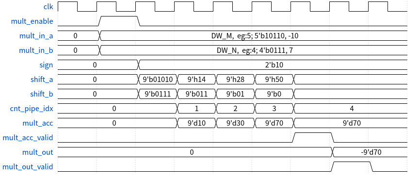
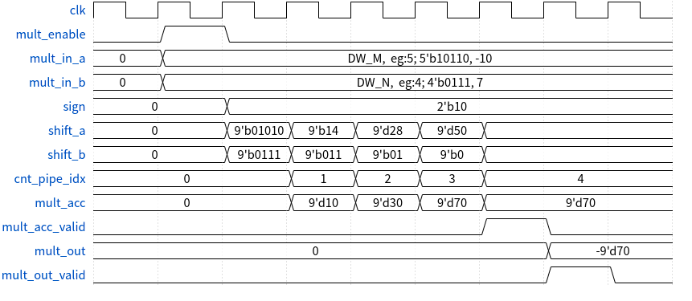
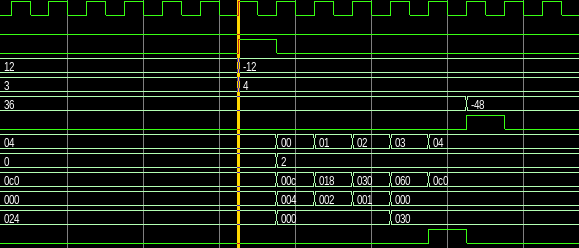
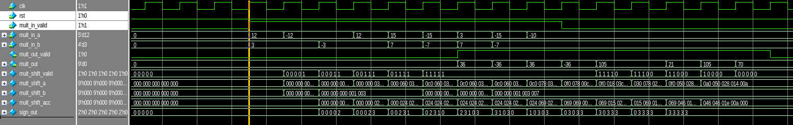

# 基于流水线的乘法器

## 1. 正数的乘法的计算过程

二进制计算乘法的过程和一般的乘法的计算过程是类似的，如下面的图所示，被乘数按照乘数对应 bit 位进行移位累加，便可完成相乘的过程。

稍微转化一下，用在FPGA当中实现的时候能够简单理解的形式来描述这个过程。根据乘数的最低位的bit来判断当前的累加和是否需要加上乘数，然后依次将被乘数向左移一位，乘数向右移一位，然后再次执行前面的操作。直到乘数的最高位已经移动到bit0。

上面看到的是正数的乘法计算，如果在计算有符号数的乘法时候，该怎么去处理呢？对于有符号数，最高位为符号位，因此我们可以将有符号数的符号进行记录，并且将有符号数转换成正数进行正数的乘法运算，当正数的乘法运算完成之后，再根据前面距离的两个原始数据的符号，如果符号相同，那么通过正数计算出来的结果就是最终的结果，如果原始数据的符号不同，那么通过正数计算出来的结果还需要取负数才是最终得到的结果。

这一个过程，可以下面的时序图给出。

mult_enable有效的时候，sign记录输入的乘数和被乘数的符号位，并且将输入的乘数和被乘数都转化为正数也就是取绝对，并将这个绝对值赋值到两个移位寄存器当中。

然后被乘数的移位寄存器每个时钟周期向左移动一位，乘数的移位寄存器向右移动一位。直到乘数的移位寄存器最高位移动到bit0。这样就能得到两个数绝对值的相乘的结果。

最后再根据符号寄存器的值，计算出最终的结果。

## 2. 基本乘法器的实现

在有了上面的基本原理之后，就可以实现一个功能比较简单的乘法器了,代码可以查看mult_basic/rtl下，仿真的截图如下所示，可以完成了有符号数的计算，可以看到，使用这种方式来计算有符号数，需要的延迟为N+2,其中N就是需要移位的次数，多出来的两拍的延时，分别是用于保存符号，复位寄存器；通过符号计算最终结果。

## 3. 流水线乘法器

上面的基本的乘法器，每次计算都需要等待6拍的延时才能出数据，如果我们仔细观察上面实现的结构，可以看到不同时钟周期做的事情是一样的，因此可以将这些操作按照流水线的方式来完成，这样会消耗更多资源，但是能够使得乘法的计算变得连续。

流水线乘法器可以在mult_pipe/rtl下查看源码，输出数据的延迟与基本的乘法器是一致的，也是N+2；

